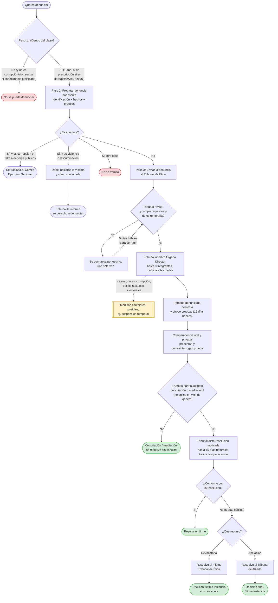

# Cómo Presentar una Denuncia ante el Tribunal de Ética

Guía práctica sobre cómo iniciar una denuncia ante el [Tribunal de Ética](../organismos/tribunal-de-etica.md) del Frente Amplio, según el [Capítulo III del Código de Ética](https://www.frenteamplio.org/wp-content/uploads/2025/05/Codigo-de-Etica-FA.pdf). Cualquier persona puede denunciar — afiliada o no.

## Paso 1: Verificá el plazo

- Plazo general: **un año** desde que tuviste conocimiento de los hechos (salvo que hayas estado impedido/a por causas justificadas, en cuyo caso el plazo corre desde que cesó ese impedimento).
- Violencia contra las mujeres en la política: un año desde el último hecho de violencia.
- Actos de corrupción o violencia sexual: **no prescriben** — se pueden denunciar en cualquier momento.

## Paso 2: Preparar la denuncia por escrito

La denuncia se presenta directamente ante el Tribunal de Ética, por escrito, con al menos:

- **Identificación de las partes**: tus nombres y apellidos, tus calidades, y un medio para recibir notificaciones. Si conocés la identidad de la persona denunciada (número de cédula, forma de contactarla), incluila también.
- **Los hechos**, expuestos de forma clara y detallada.
- **Las pruebas** que ofrecés, con nombre y forma de contactar a las personas testigas si las hay. Los documentos hay que aportarlos directamente, o indicar en qué archivo u oficina del partido se encuentran si vos no los tenés.

No es obligatorio calificar qué falta del Código se configura con los hechos — eso lo determina el Tribunal, no quien denuncia. Rige el principio de informalismo: no hace falta un formato legal rígido.

**Denuncias anónimas no se tramitan**, con dos excepciones: actos de corrupción o faltas contra los deberes de la función pública (el Tribunal las traslada al Comité Ejecutivo Nacional para una investigación preliminar), y actos de violencia o discriminación (donde al menos hay que indicar quién es la presunta víctima y cómo contactarla, para que el Tribunal le informe su derecho a denunciar).

## Paso 3: Dónde enviarla

El Código de Ética ubica la sede del Tribunal de Ética en las oficinas centrales del partido, y establece que el Tribunal habilita los correos electrónicos que considere necesarios para recibir notificaciones — pero el propio Código no fija una dirección de correo o canal único y público para presentar denuncias. **Esta guía no puede indicar todavía un correo o formulario específico** porque esa información no está confirmada; hasta que se verifique, la vía más segura es consultar directamente con la Secretaría General o el CEC del cantón sobre el canal vigente.

## Qué pasa después de enviarla

1. El Tribunal revisa que la denuncia cumpla los requisitos del Paso 2 y que no sea manifiestamente temeraria. Si falta algo, te lo comunica por escrito una sola vez, con **cinco días hábiles** para corregirlo.
2. Si procede, el Tribunal nombra un **Órgano Director** (hasta tres integrantes) que investiga los hechos, y notifica a ambas partes.
3. La persona denunciada tiene **quince días hábiles** para contestar y ofrecer sus propias pruebas.
4. Se realiza una **comparecencia oral y privada** donde ambas partes pueden presentar y contrainterrogar prueba, incluida testimonial.
5. El Tribunal dicta una resolución motivada, en un plazo de hasta **quince días naturales** tras la comparecencia.

En casos graves (p. ej. corrupción, delitos sexuales, delitos electorales con requerimiento de citación a juicio), el Tribunal puede dictar medidas cautelares, incluida la suspensión temporal de un cargo, mientras el proceso avanza.

## Si no estás de acuerdo con la resolución

Existen dos recursos posibles, dentro de los **cinco días hábiles** siguientes a la notificación:

- **Recurso de revocatoria**, que resuelve el mismo Tribunal de Ética.
- **Recurso de apelación**, que resuelve el Tribunal de Alzada en última instancia.

## Alternativas antes de llegar a sanción

Si ambas partes lo aceptan, el Tribunal puede facilitar una **conciliación** o una **mediación** en lugar de resolver por sanción — excepto en casos de violencia de género o violencia contra las mujeres en la política, donde la conciliación no procede.

## Estado de esta guía

_Falta confirmar el canal oficial de recepción de denuncias (correo electrónico o formulario específico) — el Código de Ética no lo fija de forma pública. Actualizar esta guía en cuanto se confirme esa información._

## Ver también

- **[Tribunal de Ética](../organismos/tribunal-de-etica.md)** — quién lo integra y su autonomía.
- **[Código de Ética del Frente Amplio (Resumen)](../principios/codigo-de-etica.md)** — el marco completo: las sanciones posibles y sus causales.
- **[Sanciones Disciplinarias y Revocatoria de Mandato](../organismos/sanciones-disciplinarias.md)** — el marco estatutario detrás de este procedimiento.
