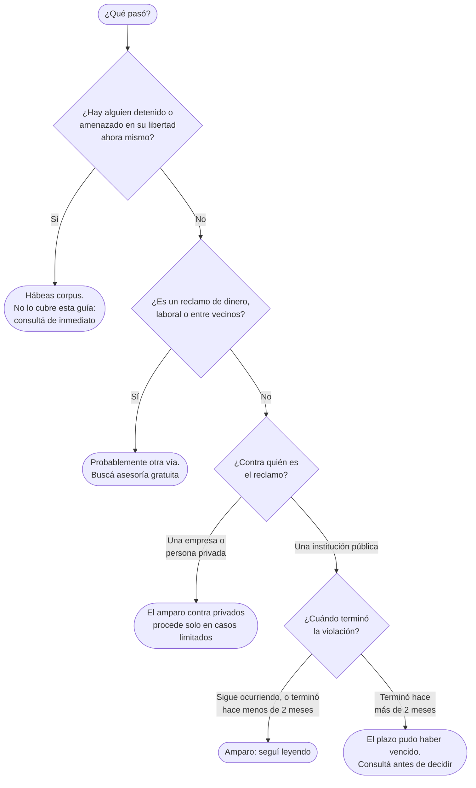

# Cómo Presentar un Recurso de Amparo

Guía práctica para quien siente que una institución pública le violó un derecho fundamental y quiere pedirle a la Sala Constitucional que lo restablezca. No hace falta ser afiliada al partido ni ser abogada.

:::note[Recurso independiente]

Este es un recurso independiente, de acceso democrático: cualquier persona puede usarlo, sin afiliarse al Frente Amplio ni registrarse en ninguna parte. Vive en esta sección de consulta, pero no es un documento del partido, no fue aprobado por él y el Frente Amplio no responde por su contenido.

:::

:::caution

Esta guía es informativa y no sustituye asesoría legal. Todavía no la revisó una persona abogada, y los artículos que cita no se cotejaron con el texto vigente. Antes de presentar nada, verificá los plazos y requisitos en las fuentes de la sección [Dónde verificar](#dónde-verificar) y, si podés, consultá con un servicio de asesoría gratuita.

:::

## Qué es y para qué sirve

La [Constitución Política](http://www.pgrweb.go.cr/scij/) (art. 48) reconoce dos recursos ante la Sala Constitucional: el **hábeas corpus**, para proteger la libertad y la integridad personales, y el **amparo**, para mantener o restablecer el goce de los demás derechos fundamentales. La Ley de la Jurisdicción Constitucional (N.º 7135) desarrolla ambos.

Con un amparo le pedís a la Sala que ordene a una autoridad detener, corregir o cumplir algo que está violando un derecho: una atención de salud negada, un trámite de educación que no avanza, una solicitud de información pública sin respuesta. No es la vía para cobrar una deuda, resolver un conflicto laboral o pelear con un vecino; para eso suele haber otras vías.

Según la guía de la Sala, el recurso lo puede presentar cualquier persona, por sí misma o a favor de otra, y no exige abogado.

## ¿Es un amparo o un hábeas corpus?

Las respuestas que desvían del amparo orientan, no prohíben: cualquier persona puede presentar el recurso y es la Sala quien decide si lo admite. Tres puntos merecen una explicación:

- **Contra privados.** El amparo está pensado sobre todo contra autoridades públicas. La Ley 7135 (art. 57) lo admite contra personas o empresas privadas solo en casos limitados, por ejemplo cuando ejercen funciones públicas o tienen una posición de poder frente a la cual las vías comunes resultan insuficientes o tardías.
- **El plazo.** Mientras la violación siga ocurriendo se puede presentar. Si ya terminó, el plazo es de dos meses desde que cesaron sus efectos (Ley 7135, art. 35). Si no estás segura o seguro de cuándo terminó, presentá cuanto antes.
- **Hábeas corpus.** Es un recurso distinto, más corto y urgente, y esta guía no lo cubre. Si hay una persona detenida ahora, no esperes a terminar de leer: consultá directamente el sitio de la Sala o a una persona abogada.

## Qué reunir antes de escribir

El escrito responde ocho preguntas. Tenerlas contestadas antes de empezar hace que redactarlo lleve una tarde y no una semana.

| # | Qué necesitás | Cómo decirlo |
| --- | --- | --- |
| 1 | Quién presenta el recurso | Tu nombre completo, número de cédula y un medio para localizarte. |
| 2 | A quién se le violó el derecho | Puede ser otra persona. Si es tu hija, tu madre o una vecina, indicalo. |
| 3 | Contra qué institución, y quién la dirige | Nombre de la institución y el cargo de quien la dirige (la persona jerarca). El cargo alcanza; no hace falta el nombre. |
| 4 | Qué pasó | En hechos numerados, en orden cronológico, con fechas y lugares. |
| 5 | Qué derecho se afectó | En palabras simples: la salud, la educación, el acceso a información pública. |
| 6 | Qué le pedís a la Sala | Algo concreto: qué debe hacer o dejar de hacer la institución. |
| 7 | Qué pruebas tenés | Documentos, correos, fotos, constancias. Guardá los originales y adjuntá copias legibles. |
| 8 | Dónde te notifican | Un correo u otro medio que revisés seguido, porque la Sala responde por ahí. |

### Cómo redactar los hechos

Es la parte que más pesa y la que más cuesta. Tres reglas:

1. **Un hecho por número.** Cada número cuenta una sola cosa que pasó.
2. **Fechas y lugares concretos.** "El 12 de marzo de 2026 presenté una solicitud por escrito", no "hace un tiempo pedí".
3. **Hechos, no opiniones.** "Han pasado tres meses sin respuesta" sirve; "la institución me trata con desprecio" no. Lo que pensás de lo ocurrido va, si acaso, en una sola frase al final.

Los ejemplos de esta sección son inventados y sirven solo para ilustrar el estilo.

## Cómo se presenta

Escrito el recurso, hay que hacerlo llegar a la Sala. Entre los medios que ha aceptado la Sala están presentarlo en persona, por fax y por internet. Los medios y requisitos vigentes están en su sitio; consultalos ahí antes de ir o de enviar nada.

Sobre la presentación por internet: según la página de la Sala, requiere una clave del Poder Judicial que se solicita en persona. Por eso conviene tramitarla con tiempo si pensás usar esa vía.

Cuando presentes el recurso, guardá el comprobante de recibo. Después, la Sala suele pedir un informe a la institución señalada y luego resuelve y notifica al medio que indicaste. Los plazos de esa etapa están en la ley y en la guía de la Sala.

## Dónde recibir ayuda gratuita

Si querés que alguien revise tu escrito antes de presentarlo, los Consultorios Jurídicos de la Universidad de Costa Rica, en San Pedro de Montes de Oca, ofrecen asesoría jurídica gratuita. Consultá directamente sus horarios y si atienden tu tipo de caso.

## Dónde verificar

Todo lo anterior debe contrastarse con las fuentes originales, que son las que valen:

- [Sistema Costarricense de Información Jurídica (SCIJ)](http://www.pgrweb.go.cr/scij/): texto vigente de la Constitución y de la Ley 7135.
- [Guía para presentar un recurso de amparo](https://salaconstitucional.poder-judicial.go.cr/images/2025/Guia%20para%20presentar%20un%20recurso%20de%20amparo.pdf), de la Sala Constitucional.
- [Presentar un recurso por internet](https://salaconstitucional.poder-judicial.go.cr/index.php/informacion-complementaria/presentar-recurso-via-web), en el sitio de la Sala.

## Un asistente para armar el escrito

Se está evaluando sumar a este sitio un asistente gratuito que haga estas mismas preguntas una por pantalla y arme el escrito para descargarlo. La imagen muestra cómo podría verse. Es una ilustración: el asistente todavía no existe.

Cómo se piensa:

- Una pregunta por pantalla, con letra grande y un ejemplo, pensado para usarse desde el celular.
- Las preguntas de orientación avisan, pero nunca impiden seguir.
- Los datos de la persona se quedan en su dispositivo; el diseño no prevé servidor ni cuenta.
- No presenta el recurso por nadie: presentarlo sigue siendo un paso que hace la persona, como se explica arriba.

No se publicará hasta que una persona abogada revise sus preguntas de orientación y el texto del escrito que genera.

## Estado de esta guía

_Pendiente: cotejar cada artículo citado con el texto vigente en el SCIJ, confirmar los medios de presentación vigentes con la Sala y que una persona abogada revise la guía completa. Mientras tanto se publica con el aviso del inicio. Verificar también qué tipos de caso atienden los Consultorios Jurídicos._
